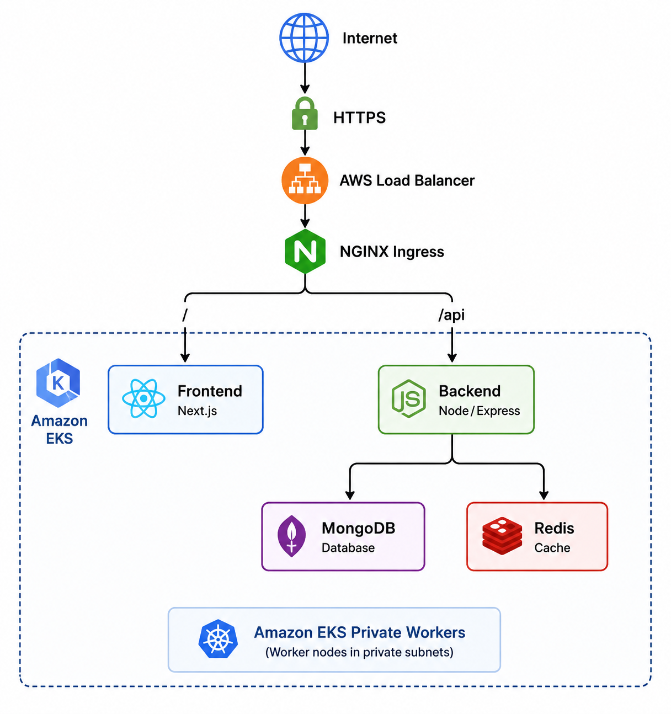

# Expensy - End-to-End DevOps Deployment

Expensy is a full-stack expense tracking application deployed on **Amazon EKS**.

This project demonstrates an end-to-end DevOps workflow including containerization, Infrastructure as Code, Kubernetes orchestration, CI/CD, HTTPS, monitoring, centralized logging, and security practices.

## Deployment Options

This project documents three ways to run and deploy Expensy:

1. **Local Development** – Run the frontend and backend locally using Node.js.
2. **Docker Compose** – Run the complete application stack (frontend, backend, MongoDB, and Redis) using containers.
3. **Amazon EKS** – Deploy the production-style environment to AWS using Terraform, Kubernetes, and the CI/CD pipeline.

## Architecture

The application uses:

- **Frontend:** Next.js
- **Backend:** Node.js / Express
- **Database:** MongoDB
- **Cache:** Redis
- **Containers:** Docker
- **Container Registry:** Docker Hub
- **Infrastructure:** Terraform
- **Orchestration:** Amazon EKS / Kubernetes
- **Ingress:** NGINX Ingress Controller
- **DNS:** Amazon Route 53
- **TLS:** cert-manager + Let's Encrypt
- **CI/CD:** GitHub Actions
- **Monitoring:** Prometheus + Grafana
- **Logging:** Amazon CloudWatch



## Repository Structure

```text
.github/workflows/   # GitHub Actions CI/CD
expensy_frontend/    # Next.js frontend
expensy_backend/     # Node.js/Express backend
kubernetes/          # Kubernetes manifests
terraform/           # EKS infrastructure
monitoring/          # Grafana dashboard and monitoring documentation
```

---

# Local Development

## Backend

Install dependencies:

```bash
cd expensy_backend
npm install
```

Configure the required environment variables:

```text
PORT
DATABASE_URI
REDIS_HOST
REDIS_PORT
REDIS_PASSWORD
```

Start the backend:

```bash
npm start
```

The `start` script builds the TypeScript application and starts the server from `dist/server.js`.

## Frontend

Install dependencies and start the development server:

```bash
cd expensy_frontend
npm install
npm run dev
```

The frontend uses:

```text
NEXT_PUBLIC_API_URL
```

to determine the backend API URL.

---

# Containerization

The frontend and backend use separate Dockerfiles:

```text
expensy_frontend/Dockerfile.frontend
expensy_backend/Dockerfile.backend
```

A `docker-compose.yaml` is included for running the complete application stack locally.

Start the stack with:

```bash
docker compose up --build
```

This starts:

- MongoDB
- Redis
- Backend
- Frontend

Stop the stack with:

```bash
docker compose down
```

---

# Infrastructure with Terraform

AWS infrastructure is provisioned using **Terraform**.

The Terraform configuration creates:

- VPC across two Availability Zones
- Two public subnets
- Two private subnets
- NAT Gateway
- Amazon EKS cluster
- EKS managed node group
- Worker nodes deployed in private subnets

The managed node group is configured with:

```text
Minimum nodes: 1
Desired nodes: 2
Maximum nodes: 3
Instance type: t3.medium
```

Public subnets are available for internet-facing infrastructure such as AWS Load Balancers, while EKS worker nodes are deployed in private subnets.

## Create the EKS Cluster

The Terraform helper script can be used to provision the infrastructure:

```bash
cd terraform
chmod +x up.sh down.sh
./up.sh ahsan-final1
```

The script:

1. Initializes Terraform
2. Creates the AWS infrastructure
3. Configures `kubectl` for the EKS cluster
4. Displays the EKS worker nodes

Verify the cluster:

```bash
kubectl get nodes
```

Terraform can also be executed directly:

```bash
terraform init

terraform apply \
  -var="student_name=ahsan-final1"
```

Configure `kubectl` manually if required:

```bash
aws eks update-kubeconfig \
  --name eks-ahsan-final1 \
  --region us-east-1
```

## Destroy the Infrastructure

```bash
cd terraform
./down.sh ahsan-final1
```

The script removes Kubernetes LoadBalancer services before destroying the Terraform-managed AWS infrastructure.

---

# Kubernetes Deployment

Kubernetes manifests are stored in:

```text
kubernetes/
```

They define the:

- Frontend Deployment and Service
- Backend Deployment and Service
- MongoDB Deployment and Service
- Redis Deployment and Service
- ConfigMap
- Ingress
- TLS ClusterIssuer

MongoDB, Redis, frontend, and backend communicate using Kubernetes services.

## Configuration and Secrets

Non-sensitive configuration is stored in a Kubernetes **ConfigMap**.

Sensitive values such as MongoDB credentials, the database URI, and Redis password are stored in:

```text
expensy-secrets
```

The real secret manifest:

```text
kubernetes/secrets.yaml
```

is excluded from Git using `.gitignore`.

A safe example containing placeholder values is provided as:

```text
secrets.example.yaml
```

For CI/CD deployments, the Kubernetes Secret is created or updated using **GitHub Actions Secrets**.

## Deploy the Application

After EKS and the required cluster-level components are configured:

```bash
kubectl apply -f kubernetes/
```

Verify the deployment:

```bash
kubectl get pods
kubectl get svc
kubectl get ingress
```

---

# NGINX Ingress and HTTPS

The application uses the **NGINX Ingress Controller** to route incoming traffic.

```text
/       → frontend-service
/api    → backend-service
```

NGINX Ingress Controller and **cert-manager** are cluster-level components and are installed separately from the normal application CI/CD pipeline.

The repository contains:

```text
kubernetes/ingress.yaml
kubernetes/cluster-issuer.yaml
```

The Ingress defines application routing and TLS configuration, while the ClusterIssuer configures certificate issuance using **Let's Encrypt**.

DNS is managed using **Amazon Route 53**.

The deployed application is available securely at:

```text
https://expensy-ahsan.ironlabs.online
```

HTTP requests are redirected to HTTPS.

---

# CI/CD Pipeline

CI/CD is implemented using **GitHub Actions**.

The workflow is stored at:

```text
.github/workflows/ci-cd.yaml
```

The pipeline runs automatically when changes are pushed to the `main` branch and can also be started manually using `workflow_dispatch`.

The pipeline performs:

```text
Push to main
      |
      v
Checkout source
      |
      v
Build frontend/backend Docker images
      |
      v
Push images to Docker Hub
      |
      v
Authenticate with AWS
      |
      v
Connect to EKS
      |
      v
Create/update Kubernetes Secret
      |
      v
Apply Kubernetes manifests
      |
      v
Restart frontend/backend Deployments
      |
      v
Verify rollout
```

The Docker builds install application dependencies and run the frontend/backend build processes.

The frontend image receives the production API URL during the Docker build:

```text
NEXT_PUBLIC_API_URL=https://expensy-ahsan.ironlabs.online
```

## GitHub Actions Secrets

The following GitHub repository secrets are required:

```text
DOCKERHUB_USERNAME
DOCKERHUB_TOKEN

AWS_ACCESS_KEY_ID
AWS_SECRET_ACCESS_KEY

REDIS_PASSWORD
MONGO_USERNAME
MONGO_PASSWORD
DATABASE_URI
```

The pipeline uses these values without storing credentials directly in the workflow or repository.

MongoDB and Redis credentials are used to create or update the Kubernetes `expensy-secrets` Secret during deployment.

---

# Monitoring and Logging

The EKS environment uses:

- **Prometheus** for Kubernetes and container metrics
- **Grafana** for dashboards and visualization
- **Amazon CloudWatch Container Insights** for centralized application and container logging

Prometheus and Grafana are installed using the `kube-prometheus-stack` Helm chart.

The exported Expensy Grafana dashboard is stored at:

```text
monitoring/expensy-dashboard.json
```

CloudWatch application logs are available under:

```text
/aws/containerinsights/eks-ahsan-final1/application
```

Detailed installation and usage instructions are available in:

```text
monitoring/README.md
```

Prometheus, Grafana, and CloudWatch are cluster-level components and are configured separately from the normal application CI/CD pipeline.

---

# Security and Compliance

The deployment implements security practices including:

- AWS IAM roles for EKS
- Private EKS worker nodes
- Kubernetes Secrets
- GitHub Actions Secrets
- Internal Kubernetes services
- NGINX Ingress
- HTTPS/TLS
- Centralized monitoring and logging

The real Kubernetes secret manifest is excluded from Git.

Detailed information about IAM, secrets management, networking, TLS, retention, data protection, and compliance is available in:

```text
SECURITY.md
```

---

# Useful Commands

Check application pods:

```bash
kubectl get pods
```

Check services:

```bash
kubectl get svc
```

Check ingress:

```bash
kubectl get ingress
```

Check deployments:

```bash
kubectl get deployments
```

View backend logs:

```bash
kubectl logs -f deployment/expensy-backend -c backend
```

Check monitoring pods:

```bash
kubectl get pods -n monitoring
```

Access Grafana:

```bash
kubectl port-forward \
  svc/kube-prometheus-stack-grafana \
  -n monitoring \
  3001:80
```

Grafana is then available at:

```text
http://localhost:3001
```

---

# Technology Stack

| Area | Technology |
|---|---|
| Frontend | Next.js |
| Backend | Node.js / Express |
| Database | MongoDB |
| Cache | Redis |
| Containers | Docker |
| Registry | Docker Hub |
| Infrastructure | Terraform |
| Orchestration | Amazon EKS / Kubernetes |
| Ingress | NGINX Ingress Controller |
| DNS | Amazon Route 53 |
| TLS | cert-manager / Let's Encrypt |
| CI/CD | GitHub Actions |
| Metrics | Prometheus |
| Dashboards | Grafana |
| Logging | Amazon CloudWatch |